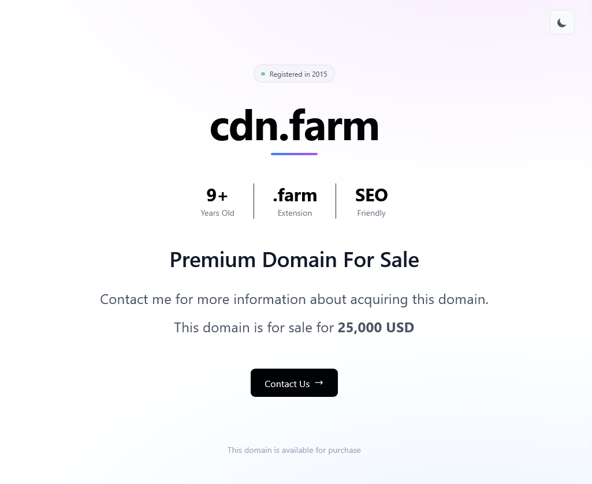

# Domain Parkour

An ultra-minimal domain parking page for Cloudflare Workers. One deployment handles multiple domains with secure configuration via Cloudflare KV.



## Features

- Multi-domain support from single deployment
- Secure config storage in Cloudflare KV
- Global edge deployment
- Per-domain customization
- Responsive design
- Automatic light/dark mode with customizable accent color

## Quick Setup

```bash
# Install
npm install && npx wrangler login

# Create KV namespace
wrangler kv:namespace create "domain-parkour-kv"
# Or create via Cloudflare Dashboard
# Copy the namespace ID from output

# Update wrangler.toml with your namespace ID

# Add domain config to KV
wrangler kv:key put --namespace-id=domain-parkour-kv "yourdomain.com" '{"title":"Premium Domain For Sale","salePrice":"25,000 USD","contactEmail":"contact@example.com"}'

# Add default fallback
wrangler kv:key put --namespace-id=domain-parkour-kv "_default" '{"title":"Domain For Sale","salePrice":"Make an Offer"}'

# Configure routes in wrangler.toml and deploy
npm run deploy
```

## Configuration

### Cloudflare KV (Recommended)

```bash
# Add/update domain
wrangler kv:key put --namespace-id=domain-parkour-kv "cdn.farm" '{"title":"CDN Farm","salePrice":"25k"}'

# List domains
wrangler kv:key list --namespace-id=domain-parkour-kv

# View config
wrangler kv:key get --namespace-id=domain-parkour-kv "cdn.farm"
```

### Config Properties

- `title` - Headline text
- `description` - Description
- `registrationDate` - YYYY-MM-DD format
- `salePrice` - Price text
- `contactEmail` - Contact email
- `accentColor` - Hex color for branding (gradient line, button, background glow)

Sample: Add to CF DASH/KV/domain-parkour-kv OR via CLI:

```bash
wrangler kv:key put --namespace-id=domain-parkour-kv "example.com" '{
  "title": "Premium Domain For Sale",
  "description": "This premium domain is available for purchase",
  "registrationDate": "2010-01-15",
  "salePrice": "50,000 USD",
  "contactEmail": "contact@example.com",
  "accentColor": "#3b82f6"
}'
```

### Environment Variables (Optional)

Override via Cloudflare Dashboard:

```bash
# Domain-specific (dots become underscores)
CDN_FARM_TITLE="Custom Title"

# Global fallback
TITLE="Default Title"
```

## How It Works

The worker follows this configuration priority order:

1. **Cloudflare KV** - Checks `DOMAIN_CONFIGS` namespace for exact hostname match (e.g., `example.com`)
2. **KV Default Fallback** - Checks `DOMAIN_CONFIGS` for `_default` key
3. **Environment Variables** - Checks domain-specific env var (e.g., `EXAMPLE_COM_CONFIG` for `example.com`)
4. **Hardcoded Defaults** - Uses minimal safe defaults (no sensitive data)

After loading base config, individual properties can be overridden by:

- Domain-specific env vars: `EXAMPLE_COM_TITLE`, `EXAMPLE_COM_SALE_PRICE`, etc.
- Global env vars: `TITLE`, `SALE_PRICE`, etc.

**Hostname transformation for env vars:**

- `127.0.0.1` → `127_0_0_1_CONFIG`
- `example.com` → `EXAMPLE_COM_CONFIG`
- `cdn-farm.io` → `CDN_FARM_IO_CONFIG`

## Adding Domains

1. Add to KV: `wrangler kv:key put --namespace-id=domain-parkour-kv "new.com" '{...}'`
2. Add route in wrangler.toml
3. Redeploy: `npm run deploy`

## Security

Use Cloudflare KV or encrypted Dashboard secrets.

## Development

```bash
npm run dev

# Local testing (create .dev.vars)
echo 'TEST_CONFIG={"title":"Local Test"}' > .dev.vars
```

## Troubleshooting

```bash
# Check KV
wrangler kv:namespace list
wrangler kv:key list --namespace-id=domain-parkour-kv

# Live logs
wrangler tail
```

## License

MIT
