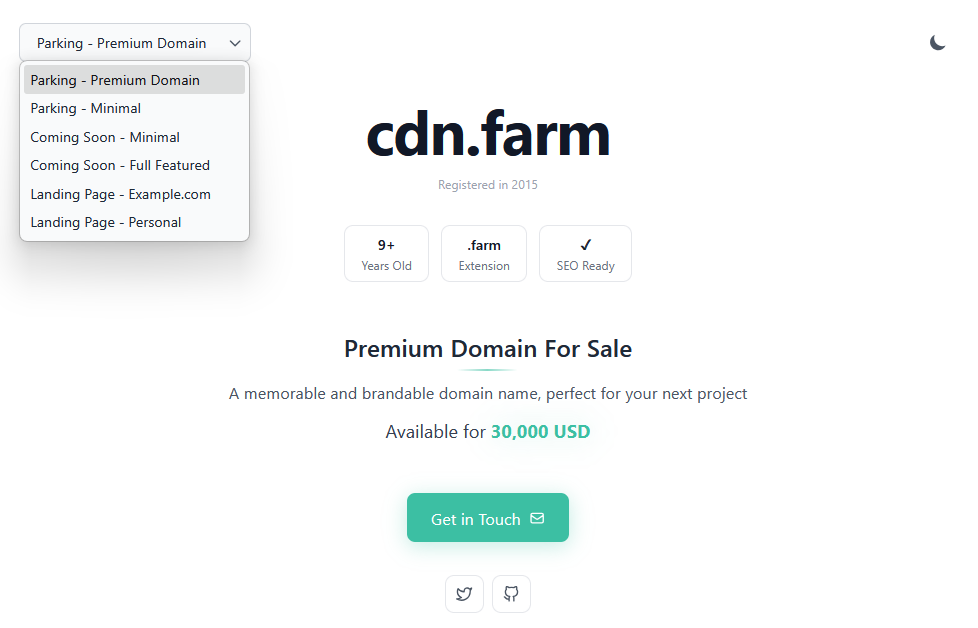

# Domain Parkour

A super-minimal domain parking page built for Cloudflare Workers for showcasing domains that are for sale with a clean, centered design.



## Features

**Ultra Minimal Design** - Clean, centered layout focused on the domain name and details
**Fully Customizable** - Configure via `config.json` or environment variables  
**Cloudflare Workers** - Deploy globally in seconds  
**Easy Configuration** - Override any setting with environment variables  
**Responsive** - Looks great on all devices

## Configuration

### Default Configuration (`config.json`)

```json
{
  "domain": "example.com",
  "title": "Premium Domain For Sale",
  "description": "This premium domain is available for purchase...",
  "domainAge": "Registered since 2010",
  "contactEmail": "contact@example.com",
  "backgroundColor": "#0f172a",
  "textColor": "#f1f5f9",
  "accentColor": "#3b82f6"
}
```

### Environment Variable Overrides

All configuration can be overridden with environment variables:

- `DOMAIN` - The domain name to display
- `TITLE` - Title text
- `DESCRIPTION` - Description text
- `DOMAIN_AGE` - Domain registration age/info
- `CONTACT_EMAIL` - Contact email address
- `BG_COLOR` - Background color (hex)
- `TEXT_COLOR` - Text color (hex)
- `ACCENT_COLOR` - Accent/highlight color (hex)

Set these in `wrangler.toml` under `[vars]` or in the Cloudflare dashboard.

## Setup

### Prerequisites

- Node.js 16+ installed
- A Cloudflare Account
- Wrangler CLI

### Installation

1. **Install dependencies:**

   ```bash
   npm install
   ```

2. **Login to Cloudflare:**

   ```bash
   npx wrangler login
   ```

3. **Configure your domain:**

   Edit `config.json` with your domain details, or set environment variables in `wrangler.toml`.

## Development

Run locally with hot reload:

```bash
npm run dev
```

Visit `http://localhost:8787` to preview your parking page.

## Deployment

### Deploy to Cloudflare Workers

```bash
npm run deploy
```

### Configure Domain Routing

After deployment, configure your domain in `wrangler.toml`:

```toml
routes = [
  { pattern = "yourdomain.com", zone_name = "yourdomain.com" }
]
```

Or set up routes in the Cloudflare dashboard under Workers > Routes.

### Set Environment Variables

**Option 1: Via wrangler.toml**

Uncomment and edit the `[vars]` section in `wrangler.toml`.

**Option 2: Via Cloudflare Dashboard**

1. Go to Workers & Pages
2. Select your worker
3. Navigate to Settings > Variables
4. Add environment variables

### Optional: GitHub Actions (CI) Deployment

You can deploy automatically from GitHub using Actions. Create the following repository secrets in GitHub (Settings > Secrets & variables > Actions):

- `CLOUDFLARE_API_TOKEN` — a scoped API token that can publish workers
- `CLOUDFLARE_ACCOUNT_ID` — your Cloudflare account ID

There is an example workflow in `.github/workflows/deploy.yml` that will run on pushes to `main` and on manual dispatch. It checks out the repo, installs dependencies, and runs `npx wrangler deploy` using the secrets above.

Important: when using GH Actions, configure your environment variables either via `wrangler.toml` in the repository or using repository-level secrets and environment variables in the Actions workflow.

## Customization Examples

### Dark Purple Theme

```json
{
  "backgroundColor": "#1e1b4b",
  "textColor": "#e0e7ff",
  "accentColor": "#8b5cf6"
}
```

### Light Theme

```json
{
  "backgroundColor": "#f8fafc",
  "textColor": "#1e293b",
  "accentColor": "#0ea5e9"
}
```

### Minimal Green

```json
{
  "backgroundColor": "#052e16",
  "textColor": "#dcfce7",
  "accentColor": "#22c55e"
}
```

## Project Structure

```text
domain-parkour/
├── src/
│   └── index.js          # Main worker script
├── config.json           # Default configuration
├── wrangler.toml         # Cloudflare Workers config
├── package.json          # Dependencies
└── README.md            # Documentation
```

## License

MIT License - feel free to use this for your domain parking needs!

## Support

For issues or questions, please open an issue on the repository.
